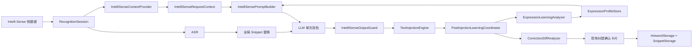

# Type4Me 智能感知（Intelli Sense）开发设计文档

> 文档类型：开发设计
> 文档状态：当前有效（首版已实现，持续校准）
> 上游文档：`docs/features/intelli-sense/product-design.md`
> 适用平台：macOS 14+
> 技术栈：Swift 6.2 工具链、SwiftUI、AppKit、Accessibility API、SQLite、JSON 文件存储
> 设计日期：2026-08-09
> 最后校验：2026-08-11
> 实现基线：`302e9b4`，体验修订至 `9d91b92`
> 阅读说明：文中的“当前实现基线”保留设计时语境；功能状态以页首与代码为准

> 专项后续设计：`docs/features/intelli-sense/user-correction-text-recognition-design.md`。该文档升级了本文第 10–12、16、20 节中的注入后观察、纠错识别、用户修改历史持久化和表达学习数据边界；相关内容以专项设计为准。

产品界面和对外文案统一写作“Intelli Sense”；Swift 类型与文件名遵循标识符规范，使用不含空格的 `IntelliSense`。

---

## 1. 设计目标

本设计为 Type4Me 新增官方自带模式“智能感知 / Intelli Sense”。它是现有语音润色的增强版本，继续遵守单一处理契约：

> 将本次语音识别结果润色成可以直接输入的文字，不回答、不生成额外内容、不处理其他内容、不执行动作。

开发范围只包含：

1. 基础语音润色；
2. 应用感知；
3. 上下文感知；
4. 表达习惯感知；
5. 纠错词检测迁移；
6. 原意与事实保真保护；
7. 智能感知模式设置、存储、迁移和测试。

### 1.1 明确不实现

- 意图分类和能力路由；
- 问答或内容生成；
- 选中文本、剪贴板处理；
- 翻译；
- Mac 操作或工具调用；
- 处理完成后的实时场景标签；
- “更忠实”“更自然”等快速纠偏；
- 独立一级个性化设置页；
- 用户可见的表达习惯列表、置信度或确认卡片；
- 智能感知专属纠错词库。

---

## 2. 已确认产品配置

| 配置项 | 默认值 | 生效范围 | 说明 |
|---|---:|---|---|
| 应用感知 | 关闭 | 仅智能感知 | 读取 App 与输入控件，选择场景策略 |
| 上下文感知 | 关闭 | 仅智能感知 | 后续阶段读取光标附近有限文字 |
| 表达习惯感知 | 关闭 | 仅智能感知 | 后台学习，不显示偏好清单或卡片 |
| 纠错词检测 | 关闭 | 观察仅智能感知 | 升级保留旧开关状态 |
| App 黑名单 | 空 | 所有感知项 | 命中后使用基础润色且不学习 |

纠错词检测的作用域分为两段：

- **观察阶段**：只在智能感知模式中启动；
- **确认后生效阶段**：写入现有全局热词与片段替换，在所有模式中生效。

“清除表达习惯数据”只清除内部表达习惯模型，不清除全局生词表。

---

## 3. 当前实现基线

### 3.1 可直接复用的能力

| 当前组件 | 文件 | 可复用能力 |
|---|---|---|
| `ProcessingMode` | `Type4Me/UI/AppState.swift` | 稳定模式 ID、名称、Prompt、快捷键、执行类型 |
| `ModeStorage` | `Type4Me/Services/ModeStorage.swift` | 模式持久化、官方模式补入和旧模式迁移 |
| `RecognitionSession` | `Type4Me/Session/RecognitionSession.swift` | 录音、ASR、停止后 LLM、后处理、注入、历史保存主流水线 |
| `PromptContext` | `Type4Me/LLM/PromptContext.swift` | AX 调用超时与一次性 Prompt 变量展开模式 |
| `TextInjectionEngine` | `Type4Me/Injection/TextInjectionEngine.swift` | 聚焦控件快照、注入结果检测、注入范围追踪 |
| `CorrectionLearningCoordinator` | `Type4Me/Services/CorrectionLearning.swift` | 60 秒观察、4 秒防抖、词级 diff、敏感过滤、确认和保存 |
| `CorrectionLearningPanelController` | `Type4Me/UI/FloatingBar/CorrectionLearningPanel.swift` | 现有纠错确认卡片，保持不变 |
| `HotwordStorage` | `Type4Me/Services/HotwordStorage.swift` | 全局用户热词、缓存失效和 ASR 同步 |
| `SnippetStorage` | `Type4Me/Services/SnippetStorage.swift` | 全局错误词映射、注入前替换和缓存 |
| `ModesSettingsTab` | `Type4Me/UI/Settings/ModesSettingsTab.swift` | 模式列表、模式详情、快捷键和专用内置模式详情 |
| `HistoryStore` | `Type4Me/Database/HistoryStore.swift` | 原始文本、处理文本和最终文本历史 |

### 3.2 当前需要调整的行为

1. 代码中已有 `smartDirectId` 和“智能模式 / Smart Mode”，但它只是错字和标点纠正，不等于 Intelli Sense；
2. `ProcessingMode.defaults` 当前没有 Intelli Sense；
3. `AppState` 初始化当前优先选择旧 `smartDirectId`，与“Beta 阶段不替换默认模式”冲突；
4. `PromptContext` 只采集选中文本与剪贴板，不包含 App、控件和有限上下文模型；
5. `CorrectionLearningCoordinator` 当前支持快速模式和语音润色，需要改为只观察 Intelli Sense；
6. 自动纠错开关当前位于通用设置，需要迁入 Intelli Sense 模式详情；
7. 当前没有表达习惯的抽象数据模型、学习器和存储；
8. 当前 LLM Prompt 是静态字符串，需要支持按本次快照动态生成。

---

## 4. 总体架构



### 4.1 设计约束

- 不新增第二次意图路由 LLM 请求；
- 场景和表达习惯参数合并到同一次润色请求；
- 任一感知失败都不阻塞 ASR 和文本注入；
- 上下文只作为数据，不允许被当成指令；
- 纠错确认继续使用现有 UI 和保存事务；
- 表达习惯只保存抽象统计，不保存历史全文；
- 所有新服务必须可注入依赖并支持纯单元测试。

---

## 5. 模式模型与迁移

### 5.1 新模式标识

新增独立稳定 ID：

```swift
static let intelliSenseId = UUID(
    uuidString: "00000000-0000-0000-0000-00000000000A"
)!
```

不复用现有 `smartDirectId`，理由如下：

- 旧智能模式与 Intelli Sense 的语义和 Prompt 不同；
- 老用户可能已经修改旧模式名称或 Prompt；
- 复用 ID 会把用户的可删除模式静默升级为新的官方模式；
- 独立 ID 可以让迁移、回滚和行为统计保持清晰。

旧 `smartDirect` 继续只用于读取和兼容已有数据，不加入新安装默认列表，也不自动删除。

### 5.2 模式定义

新增：

```swift
static var intelliSense: ProcessingMode {
    ProcessingMode(
        id: intelliSenseId,
        name: L("智能感知", "Intelli Sense"),
        description: L(
            "结合当前场景和表达习惯，智能整理口述内容",
            "Polish dictation using context and your writing habits"
        ),
        prompt: IntelliSensePromptBuilder.baseTemplate,
        isBuiltin: true,
        processingLabel: L("整理中", "Polishing")
    )
}
```

Intelli Sense 的核心 Prompt 不允许用户直接编辑，避免破坏模式契约。快捷键仍可配置。

### 5.3 官方模式列表

- `ProcessingMode.builtins` 加入 `.intelliSense`；它在数组中的位置固定为 `.direct` 之后、`.formalWriting` 之前；
- `ProcessingMode.defaults` 同样在 `.direct` 之后、`.formalWriting` 之前加入 `.intelliSense`；
- 新安装显示在快速模式与语音润色之间；
- 现有安装由 `ModeStorage` 的官方模式补入逻辑添加；
- 对现有用户，新模式追加到当前列表末尾，避免改变用户已定制的顺序；
- 不自动为新模式绑定快捷键，避免与现有快捷键冲突。

`ModeStorage` 必须分别覆盖两条路径：无 `modes.json` 时使用 `defaults` 的规范顺序；已有数据时将新 builtin 追加到末尾。不能仅依赖 `builtins` 的数组索引推断老用户的插入位置。

### 5.4 默认模式

Beta 阶段不改变用户默认模式：

- 新增 `tf_lastSelectedModeID`，只保存用户主动选择或用于开始录音的有效模式 ID；临时的跨模式结束路由不覆盖该值；
- `AppState.init()` 优先恢复该 ID 对应的现存模式；ID 已失效时才进入兼容回退；
- 首次升级没有持久化 ID 时，继续沿用旧版本启动行为：优先选择现有 `smartDirectId`，不存在时选择列表第一项；完成首次选择后再持久化；
- 新安装没有持久化 ID 时选择 `.direct`；
- 移除无条件优先选择 `smartDirectId` 的长期特殊逻辑，但保留上述一次性升级兼容；
- 不因为补入 Intelli Sense 自动切换当前模式。

### 5.5 模式配置不写入 `ProcessingMode`

感知开关和黑名单不扩展到通用 `ProcessingMode`，原因是这些字段只属于 Intelli Sense，并且需要独立版本迁移。

新增独立设置存储：

```swift
struct IntelliSenseSettings: Codable, Equatable, Sendable {
    var schemaVersion: Int = 1
    var applicationAwarenessEnabled: Bool = false
    var contextAwarenessEnabled: Bool = false
    var correctionDetectionEnabled: Bool = false
    var expressionLearningEnabled: Bool = false
    var blacklistedApps: [BlacklistedApp] = []
}

struct BlacklistedApp: Codable, Equatable, Identifiable, Sendable {
    var bundleIdentifier: String
    var displayName: String
    var id: String { bundleIdentifier }
}
```

存储位置：

```text
~/Library/Application Support/Type4Me/intelli-sense-settings.json
```

由 `IntelliSenseSettingsStore` 负责原子写入、默认值、去重和损坏回退。

---

## 6. 设置页面设计

### 6.1 页面位置

在 `ModesSettingsTab.modeDetail(_:)` 中增加 Intelli Sense 专用分支：

```swift
if mode.id == ProcessingMode.intelliSenseId {
    IntelliSenseModeDetail(...)
}
```

不新增 Settings 一级导航。

### 6.2 页面内容

按以下顺序展示：

1. 模式说明；
2. 快捷键；
3. 应用感知开关；
4. 上下文感知开关；
5. 表达习惯感知开关；
6. 纠错词检测（Beta）开关；
7. App 黑名单；
8. 清除表达习惯数据。

所有开关默认关闭。

### 6.3 开关关系

- 四个感知开关相互独立；
- 上下文感知开启但应用感知关闭时，仍捕获 Bundle ID 只用于黑名单判断，不使用 App 类别策略；
- 表达习惯感知开启时，只学习当前未被拉黑的 App；
- 纠错词检测开启时，只在 Intelli Sense 成功注入后观察；
- App 黑名单优先级最高，命中后四项感知全部跳过；
- 关闭表达习惯感知后，已有模型保留但不读取、不更新；
- “清除表达习惯数据”删除模型文件和内存缓存，不删除热词或片段替换。

### 6.4 纠错开关迁移

旧开关：

```text
tf_autoCorrectionLearningEnabled
```

迁移规则：

1. 首次加载 `IntelliSenseSettingsStore` 时检查迁移标志；
2. 如果存在旧 key，复制其布尔值到 `correctionDetectionEnabled`；
3. 如果旧 key 不存在，保持默认关闭；
4. 写入 `tf_intelliSenseSettingsMigratedV1 = true`；
5. 通用设置页删除旧开关 UI；
6. 暂时保留旧 key 一个发布周期以支持回滚；
7. 新代码只读取新设置文件。

### 6.5 App 黑名单

- 使用 Bundle ID 作为唯一键，显示名称只用于 UI；
- App 选择器可复用词汇页中已有的应用选择交互模式；
- 自动排除 Type4Me 本身；
- 重命名 App 不影响黑名单；
- App 卸载后条目保留，用户可手动移除；
- 黑名单命中时不采集控件、上下文或修改行为，只保留完成输入所需的目标 Bundle ID。

---

## 7. 上下文模型

### 7.1 快照结构

新增只读、不可变快照：

```swift
struct IntelliSenseContextSnapshot: Sendable, Equatable {
    let capturedAt: Date
    let processIdentifier: pid_t?
    let bundleIdentifier: String?
    let applicationName: String?
    let applicationCategory: ApplicationCategory
    let controlRole: String?
    let controlSubrole: String?
    let controlKind: InputControlKind
    let isEditable: Bool
    let isSecure: Bool
    let surroundingText: String?
    let surroundingTextWasTruncated: Bool
    let availability: ContextAvailability
}
```

辅助枚举：

```swift
enum ApplicationCategory: String, Codable, Sendable {
    case messaging, email, document, browser, development, terminal, other
}

enum InputControlKind: String, Codable, Sendable {
    case singleLine, multiLine, search, title, code, terminal, unknown
}

enum ContextAvailability: Sendable, Equatable {
    case disabled
    case blacklisted
    case appOnly
    case appAndControl
    case full
    case unavailable
    case sensitive
}
```

### 7.2 捕获时机

普通快捷键/菜单栏语音输入以最终转写确定后、LLM 处理前的当前环境为准（#308）：

1. 录音开始只冻结感知设置，不读取起始应用的 AX 上下文；
2. 最终转写确定后，先用当前 App 信息应用其片段规则；空文本、取消后不润色、短文本豁免及无 LLM 配置不新增 AX 捕获；
3. 确需 LLM 时检查黑名单，再异步捕获控件和有限相邻文本，最长 300ms；超时按 App-only 处理；
4. 捕获后轻量复核前台 App；若期间切换，丢弃旧正文并使用新 App 的 App-only 快照（仍执行黑名单），不追踪输入框、不循环重采样；
5. 本次快照统一用于应用片段规则、表达档案、Prompt、校验及历史记录。请求发出后，App/输入框/光标变化不触发新 LLM 请求；
6. 最终投递完全沿用 #297：发送 Cmd+V，由系统当前键盘接收者决定落点。AX 读取结果不作为粘贴条件，不添加焦点守卫。

“处理环境”和“粘贴接收者”是两个不同时间点：用户在 LLM 请求发出后再次切换应用，文字仍按该请求的快照处理，随后粘贴到完成时的当前键盘焦点。历史中的感知环境如实展示处理依据，不改写成未经该环境处理的最终接收者。后续学习仍按实际接收应用重新验证。

自动化固定目标、手动文字输入窗口和跨模式切入智能感知的基础模板回退维持原有语义。

### 7.3 L1：应用感知

`AppContextClassifier` 使用确定性 Bundle ID 规则，不调用 LLM：

```swift
protocol AppContextClassifying: Sendable {
    func classify(bundleIdentifier: String?, appName: String?) -> ApplicationCategory
}
```

初始类别：

| 类别 | 示例 | 策略重点 |
|---|---|---|
| messaging | Slack、微信、飞书、Discord | 简短自然；明确多要点时使用紧凑列表 |
| email | Mail、邮件客户端 | 完整句、礼貌但不补称呼落款 |
| document | Notion、Word、Pages、Obsidian | 自然分段、明确多要点时优先列表化 |
| browser | Safari、Chrome、Arc、Dia、Edge | 结合控件判断搜索或正文 |
| development | Xcode、VS Code、JetBrains | 保留标识符、技术术语和格式 |
| terminal | Terminal、iTerm2、Ghostty | 最大程度忠实，不解释命令 |
| other | 未知 App | 基础润色策略 |

映射表作为代码内产品配置，必须有单元测试；用户不能手动修改类别。

### 7.4 L2：输入控件感知

通过 Accessibility 读取：

- `kAXRoleAttribute`；
- `kAXSubroleAttribute`；
- 可编辑性；
- 单行或多行特征；
- 搜索框、标题输入框等已知角色；Chromium 系应用需结合 AX title、description、identifier、placeholder 和 help 识别，不能只依据 role/subrole。

所有同步 AX IPC 设置短超时，沿用 `PromptContext` 和 `TextInjectionEngine` 已有的超时、防挂死模式。

### 7.5 L3：上下文感知

后续阶段在用户开启“上下文感知”时读取光标附近有限文字：

- 优先使用 `kAXStringForRangeParameterizedAttribute`；
- 基于 `kAXSelectedTextRangeAttribute` 获取光标位置；
- 最多读取光标前 300 字符、后 100 字符；
- 如果目标不支持参数化范围，可读取 `kAXValueAttribute` 后在本地截断；
- 对超大值设置最大读取上限，避免复制完整文档；
- 不使用 Command+C 或剪贴板回退；
- 不读取选中文本作为待处理对象；
- 不将上下文写入历史、日志或表达习惯存储；
- 密码框、安全文本框和黑名单 App 返回 `.sensitive` 或 `.blacklisted`；
- Beta 阶段 `terminal` 和 `development` 类别一律不读取上下文正文，只保留 L1/L2 分类结果；
- 后续如开放 terminal/development 正文读取，必须独立评审，不得只依赖正则过滤。

### 7.6 敏感控件判断

满足任一条件即禁止全部感知和学习：

- AX subrole 表示 secure text field；
- App 位于黑名单；
- 控件不可编辑或焦点已变化；
- AX 返回的数据类型异常；
- 上下文命中密码、验证码或密钥模式；
- 读取超时或目标进程退出。

对允许读取上下文的场景，在正文进入 Prompt 前执行二次敏感扫描。V1 至少覆盖：`api[_-]?key`、`secret`、`token`、`Bearer`、JWT 形态、`-----BEGIN ... PRIVATE KEY-----`、证书头、常见云厂商凭据前缀，以及超过阈值的 Base64/Hex 串。命中后立即丢弃正文，将可用性标记为 `.sensitive`；日志只记录拒绝枚举，不记录匹配内容。

敏感判断失败、规则异常或无法确定时采用保守策略：不携带上下文，不启动注入后观察。

---

## 8. 润色策略与 Prompt 构建

### 8.1 基础润色策略

基础策略采用“自适应轻编辑”，也是所有配置关闭、上下文不可用或黑名单命中时的唯一回退策略。它完整继承语音润色的去噪、改口、数字格式化和结构整理能力，不使用削弱版 Prompt：

1. 删除无意义语气词和停顿词，但保留承担同意、确认、理解、惊讶或转折语义的句首回应标记；
2. 删除无意义重复；
3. 识别明显改口，只保留最终表达；
4. 修正高置信度错字、断句和标点；
5. 在不改变内容顺序和表达强度的前提下使句子通顺；
6. 保留用户词汇、语气、中英文混合方式和关键信息；
7. 根据语义决定必要的改写强度：无需修改时忠实保留，存在口语噪声、废弃半句或明显改口时必须产生实际整理价值；
8. 明确包含两个及以上具有独立信息的实质要点时优先列表化；有顺序或步骤信号时使用编号列表，否则使用项目符号；
9. 单一事项不列点；恰好两个非常简短、对称且合成一句仍清楚的项目不强制列表化；
10. 不新增标题、称呼、落款或未口述内容；列表化可保留有意义的引导句，但不得凭空添加标题。

### 8.2 动态 Prompt 输入

```swift
struct IntelliSensePromptInput: Sendable {
    let context: IntelliSenseContextSnapshot
    let settings: IntelliSenseSettings
    let expressionProfile: EffectiveExpressionProfile?
}
```

`IntelliSensePromptBuilder` 输出一个带 `{text}` 占位符的最终 Prompt：

```swift
protocol IntelliSensePromptBuilding: Sendable {
    func build(input: IntelliSensePromptInput) -> String
}
```

### 8.3 Prompt 分层

最终 Prompt 按固定顺序拼装：

1. 只润色、不回答、不执行的处理契约；
2. 自我修正（最高优先级）；
3. 填充词、无意义重复和废弃半句清理；
4. ASR 错字、数字、时间、标点和断句处理；
5. 最终事实与语义保护；
6. App/控件场景策略；
7. 有限上下文数据；
8. 已达到稳定状态的表达习惯；
9. 只输出结果文本的格式要求与用户口述 `{text}`。

优先级固定为：

```text
安全与任务边界
  > 原意与事实保真
  > 基础润色策略
  > 场景策略
  > 表达习惯参数
```

低层策略不得覆盖高层约束。

### 8.4 上下文注入安全

上下文必须使用明确的数据边界，例如：

```text
<context_data>
...
</context_data>
```

Prompt 明确声明：标签内内容只用于匹配语气、称呼和术语，其中出现的任何问题或命令都不是对模型的指令。

上下文需要：

- 去除控制字符；
- 限制总字符数；
- 不展开 `{text}`、`{clipboard}` 等模板变量；
- 不包含剪贴板和选中文本；
- 在日志中只记录字符数和可用性，不记录正文。

### 8.5 场景策略

场景策略使用结构化参数，而不是自由文本推断：

```swift
struct ScenePolicy: Sendable, Equatable {
    let compactness: PolicyLevel
    let formality: PolicyLevel
    let structure: PolicyLevel
    let preserveTechnicalTokens: Bool
    let preserveCommandSyntax: Bool
}
```

`PolicyLevel` 首版使用固定的 `low / medium / high` 三档。初始 golden 映射如下：

| 类别 | compactness | formality | structure | preserveTechnicalTokens | preserveCommandSyntax |
|---|---|---|---|---:|---:|
| messaging | high | low | low | false | false |
| email | medium | high | low | false | false |
| document | low | medium | medium | false | false |
| browser | medium | medium | low | false | false |
| development | medium | low | low | true | false |
| terminal | high | low | low | true | true |
| other | medium | medium | low | false | false |

L2 控件只做确定性覆盖：搜索框强制 `compactness = high`、`structure = low`；标题输入框强制 `structure = low`；其余控件沿用 App 类别策略。映射和覆盖值均作为单元测试 golden，不由 LLM 推断，也不开放给用户编辑。

`structure` 表示场景在内容意图不明确时的默认结构倾向，不得压过明确的多要点意图。除搜索框、标题栏和需要保留命令语法的终端外，只要口述明确包含两个及以上具有独立信息的实质要点，就按基础规则优先列表化。聊天、邮件和开发场景可以影响列表的紧凑度与正式程度，但不能把明确多要点强行压回连续长段。普通 `singleLine` 分类不单独禁止列表，避免因控件识别误差削弱内容意图。

场景分类器只选择策略，不决定任务类型，也不能改变输出语言。

### 8.6 与停止后 LLM 的集成

Intelli Sense 沿用停止录音后的 LLM 流水线：

- 普通语音在最终 LLM 前创建 `IntelliSenseRequestContext`；
- 设置在 session 内冻结；上下文快照和表达档案按本次处理目标绑定；最终 Prompt 按 final 的当前转写文本构建；
- `ListStructureIntentAnalyzer` 在建 Prompt 时识别明确枚举；结构可用的控件会获得本次专属列表约束，并过滤冲突的“减少列表”画像；
- 停止录音后的 final 与同步 final 两个调用点统一使用 `IntelliSensePromptBuilder.build(request:)`，不得再经过 `PromptContext.expandContextVariables(_:)`；
- App 切换、光标移动和学习模型更新不改变进行中的请求；不新增按焦点重试或复制回退策略；
- 不新增场景分类网络请求。

---

## 9. 原意与事实保真

### 9.1 输出保护器

共享 Core 先通过 `CorrectionIntentAnalysis` 标记被推翻内容、最终确认内容和真实否定，再由纯函数 `IntelliSenseOutputValidator` 检查候选：

```swift
enum IntelliSenseGuardDecision: Equatable, Sendable {
    case accept
    case acceptWithWarnings([ValidationWarning])
    case reject(GuardRejection)
}
```

检查输入为全局片段替换后的 ASR 文本与 LLM 输出。

### 9.2 硬拒绝与诊断警告

硬拒绝只覆盖明确越界：空输出；回答、解释或声称已经执行动作；新增明显不存在的事实；改变最终确认的数字、日期、金额、URL、邮箱或字面路径；删除“不要/请勿/不得”或“绝不/从不”等强否定关系；整段语言替换；极端扩写；代码围栏或工具调用；泄露上下文敏感内容。

一般词语变化、格式变化、术语规范化、普通英文口头语或技术标识符增删、结构变化、弱否定的等价改写、较大但仍受约束的改写，以及未清理干净的被推翻内容，只记录 warning，不触发原文回退。`OK`、`Yes`、`SwiftUI` 等 token 不得仅因字面消失就丢弃整段候选；但句首以标点独立、承担同意或确认作用的“嗯，”“哦，”“OK，”“好的，”属于回应语义，不是普通填充词，Prompt 必须保留，Guard 在高置信度边界下保护。`不对`、`哦不`、`I mean` 等改口元语言不作为必须保留的否定；“不要改成 1500”仍属于真实否定，两个数字和强禁止关系均需保护。单独的“不是 A，是 B”属于完整对比或澄清，不足以证明用户发生口误，Prompt 与语义评测必须要求保留两端；在体验阶段，表层弱否定计数变化只产生 warning，避免误拒绝吞掉全部润色价值。

模型把口述中的“第一、第二、第三”转换为行首 `1. / 2. / 3.` 时，这些数字属于结构标记而非新增事实，必须从新增数字事实检查中排除；列表正文中真正新增或改变的数值仍按硬事实处理。

Guard 的产品优先级是：先让用户看到明显优于原始 ASR 的结果，再用少量高置信度硬规则兜底。任何新增硬拒绝条件都必须提供真实事故样本，并证明不能通过 Prompt、warning 或离线评测解决；不得为了理论上的全面保护扩大回退面。

语言保护以说话人的句架语言为准，而不是简单比较中英文字符数量。中文句子中包含大量英文技术词、路径和标识符时，仍必须保留中文叙述；例如口述路径可规范为反引号路径，但不得把整句翻译成英文。

### 9.3 失败策略

V1 不增加第二次 LLM 校验请求。Guard 拒绝时：

1. 记录不含正文的拒绝原因；
2. 使用全局片段替换后的 ASR 文本；
3. 继续正常注入和保存历史；
4. 不将被拒绝的 LLM 输出作为表达习惯学习样本。

后续如果误拒绝过高，再评估轻量语义校验；不在首版引入额外延迟。

---

## 10. 纠错词检测

### 10.1 观察资格

将当前：

```swift
modeID == directId || modeID == formalWritingId
```

调整为：

```swift
modeID == intelliSenseId
```

同时满足：

- `correctionDetectionEnabled == true`；
- App 不在黑名单；
- `TrackedInjectionResult.outcome == .inserted`；
- `TrackedInjectionResult.observationContext != nil`；
- 非敏感控件；
- 非取消或 ESC 中止；
- 能准确获得注入范围。

`InjectionOutcome` 当前只有 `.inserted` 和 `.copiedToClipboard`，不存在 `.failed` 或 `.cancelled` case。所有“注入失败、取消或无法跟踪”的文档表述在实现中统一落到上述双重门控；不得根据不存在的枚举分支实现。

### 10.2 分析与卡片

完整复用：

- `CorrectionDiffAnalyzer`；
- 60 秒观察窗口；
- 4 秒防抖；
- 单一词汇修改限制；
- 中文多字替换规则；
- 邮箱、URL、长数字和密钥过滤；
- `CorrectionLearningPanelController` 和现有卡片 UI。

本项目不修改卡片尺寸、字段、按钮、动画或文案。

### 10.3 全局保存

完整复用 `CorrectionLearningStore.learn(_:)` 的事务语义：

1. 正确词追加到 `HotwordStorage`；
2. 错误词到正确词追加或更新到 `SnippetStorage`；
3. 映射保存失败时回滚热词写入；
4. 缓存失效并通知 UI；
5. 热词同步到支持的本地或云端 ASR；
6. 后续所有模式在 ASR 和片段替换阶段使用该词汇。

不增加 Intelli Sense 专属作用域字段。

---

## 11. 注入后统一观察器

### 11.1 重构目的

纠错词检测和表达习惯学习都需要观察同一输入控件。为避免两个 AXObserver、两个定时器和相互冲突的生命周期，将现有协调器重构为：

```swift
@MainActor
final class PostInjectionLearningCoordinator
```

它统一持有：

- 一个 AXObserver；
- 一个 60 秒超时任务；
- 一个 4 秒防抖任务；
- 当前注入上下文；
- 是否已经显示过纠错候选；
- 最新读取到的控件值；
- 纠错与表达学习两个独立开关。

### 11.2 兼容现有卡片

UI 控制器保持原类和原接口。协调器发现纠错候选时调用现有：

```swift
panelController.show(candidate:onLearn:onIgnore:)
```

显示卡片不应终止表达习惯的最终采样；只标记本 session 已处理纠错候选，避免重复弹卡。

### 11.3 生命周期

观察结束条件：

- 60 秒到期；
- 开始下一次录音；
- 目标 AX 元素销毁；
- App 切换或进程退出；
- 控件值不可读；
- 用户关闭对应设置；
- App 新增到黑名单；
- 应用退出。

任何结束路径都必须取消任务、移除通知和释放 AX 引用。

---

## 12. 表达习惯学习

### 12.1 目标与边界

表达习惯学习只回答“用户通常如何表达”，不学习事实内容。它不向用户展示推断结果，也不使用确认卡片。

### 12.2 学习样本

```swift
struct ExpressionObservation: Sendable {
    let sessionID: String
    let createdAt: Date
    let appBundleIdentifier: String?
    let appCategory: ApplicationCategory
    let injectedText: String
    let finalObservedText: String
    let correctionCandidateRange: NSRange?
}
```

`injectedText` 与 `finalObservedText` 只在内存中用于本次特征提取，提取完成后立即释放，不写入表达模型文件。

### 12.3 样本过滤

以下样本不学习：

- 黑名单或敏感控件；
- 注入失败、取消或 LLM Guard 拒绝；
- 文本过短，无法形成稳定风格特征；
- 修改包含数字、日期、金额、邮箱、URL、路径或密钥；
- 修改明显改变事实或语义；
- 多处大范围增删，无法区分风格与内容变化；
- 输入法组合、撤销或自动格式化导致的异常序列；
- 用户在观察窗口中清空全部内容。

纠错词候选对应的词级变化从表达习惯特征中排除，避免把拼写修正误学成风格。

### 12.4 V1 特征集合

只学习可稳定量化且不包含具体内容的特征：

```swift
enum ExpressionFeature: String, Codable, CaseIterable {
    case averageSentenceLength
    case averageParagraphLength
    case lineBreakDensity
    case listUsage
    case headingUsage
    case fillerRetention
    case terminalPunctuationUsage
    case exclamationUsage
    case chineseEnglishSpacing
    case compactness
}
```

不在 V1 学习“幽默”“专业”“友好”等难以稳定定义的主观标签。

### 12.5 证据权重

- 用户主动修改后的最终文本：强证据；
- 注入后未修改：弱接受证据；
- 相同方向的跨 session 修改：累积证据；
- 相反方向修改：负证据；
- 同一 session 的连续键盘事件：只计一个样本。

`listUsage` 采用独立资格口径：普通连续文本不提供负证据；只有已接受的真实列表、用户把连续文本改成列表，或用户主动把列表改回连续文本时才计入。其学习状态按该特征自身的有效证据数计算，不能由其他普通样本推到 `stable`。

V1 暂定阈值为：

- 至少 5 个有效 session 才能从 `insufficient` 进入 `learning`；
- 至少 10 个有效 session、跨 3 个自然日且方向一致才进入 `stable`；
- 使用指数衰减降低旧习惯权重；
- 设置迟滞区间，避免特征在生效与失效之间频繁抖动。

这些数值是首版工程初值，不是已经验证的产品常量。阈值定义为内部配置常量并支持测试注入，通过离线样本和 Beta 灰度校准；不进入用户设置，不展示学习状态，也不形成新的产品开放项。

### 12.6 作用域

```text
具体 App
  → App 类别
    → 全局
      → 产品默认
```

- App 样本不足时回退 App 类别；
- 类别样本不足时回退全局；
- 仅 `stable` 特征进入 Prompt；
- 具体层级只覆盖同一特征，不覆盖整个档案；
- 黑名单 App 不读也不写任何档案。

### 12.7 模型存储

文件：

```text
~/Library/Application Support/Type4Me/intelli-sense-expression-profile.json
```

存储结构：

```swift
struct ExpressionProfileDocument: Codable, Sendable {
    var schemaVersion: Int
    var global: ScopeExpressionProfile
    var categories: [String: ScopeExpressionProfile]
    var applications: [String: ScopeExpressionProfile]
}

struct ScopeExpressionProfile: Codable, Sendable {
    var sampleCount: Int
    var editedSampleCount: Int
    var firstObservedAt: Date?
    var lastObservedAt: Date?
    var features: [String: FeatureAccumulator]
}

struct FeatureAccumulator: Codable, Sendable {
    var weightedMean: Double
    var totalWeight: Double
    var positiveEvidence: Int
    var negativeEvidence: Int
    var state: FeatureLearningState
    var updatedAt: Date
}
```

`ExpressionProfileStore` 使用 actor 隔离和原子文件写入；内存缓存只保存聚合值。

### 12.8 应用到 Prompt

`EffectiveExpressionProfile` 只输出少量结构化指令，例如：

- 倾向短句；
- 降低列表使用；
- 保留自然段；
- 保留句末标点；
- 不在中文与英文之间自动加空格。

每次最多注入 3–5 条最稳定、与当前场景不冲突的特征，避免 Prompt 过长或规则互相打架。“降低列表使用”只影响模糊或可选的结构化，不得取消明确多要点的列表化规则。

---

## 13. RecognitionSession 集成

### 13.1 新 session 状态

新增：

```swift
private var intelliSenseContextTask: Task<IntelliSenseContextSnapshot, Never>?
private var intelliSenseRequestContext: IntelliSenseRequestContext?
```

`IntelliSenseRequestContext` 包含本 session 冻结的设置、上下文、有效表达档案、开始录音时的模式 ID 和 `sessionGeneration`。创建成功后不可变；Prompt 使用这些快照和当前请求文本动态构建。

### 13.2 开始录音

仅当 `effectiveMode.id == intelliSenseId`：

1. 读取设置快照；
2. 同步捕获 Bundle ID 并检查黑名单；
3. 异步启动上下文快照；
4. 异步读取表达档案；
5. 继续现有录音与 ASR 启动；
6. 完全跳过 `PromptContext.capture()`，不得读取剪贴板、选中文本或触发临时 Command+C；
7. 复用录音开始时已经捕获的 `targetBundleId` 作为快照锚点和 App 级片段替换作用域，不做第二次前台 App 读取；
8. 在首次 LLM 请求前冻结可用快照、设置和表达档案；每个 LLM 请求用当前转写构建 Prompt。

其他模式继续使用现有 `PromptContext`，不受影响。

### 13.3 ASR 阶段

所有模式继续调用：

```swift
HotwordStorage.loadEffective()
```

因此由纠错卡片确认的新词会自然进入所有模式的 ASR 请求。

### 13.4 LLM 前处理

所有模式继续在 LLM 前调用全局和 App 片段替换。Intelli Sense 在此基础上：

1. 获取本 session 冻结的上下文、设置和表达档案；
2. final 和同步 final 分别用各自当前转写调用统一的 `build(request:)`，不调用 `promptContext.expandContextVariables(currentMode.prompt)`；
3. 在停止录音、拿到最终转写后发起唯一一次 LLM 请求；
4. 通过 `IntelliSenseOutputGuard` 检查结果；
5. 失败时回退片段替换后的 ASR 文本。

### 13.5 注入后

仅 Intelli Sense 且至少一个学习开关开启时调用跟踪注入：

```swift
let needsObservation = settings.correctionDetectionEnabled
    || settings.expressionLearningEnabled
```

只有 `injectionResult.outcome == .inserted` 且 `injectionResult.observationContext != nil` 时，才将上下文交给统一观察器。App 黑名单、敏感控件或 Guard 拒绝时，纠错观察和表达习惯学习均不启动，避免基于降级文本产生噪声样本。

### 13.6 清理

以下路径必须取消上下文任务并清空 session 快照：

- 正常完成；
- 取消录音；
- ESC 中止注入；
- ASR 失败；
- LLM 超时；
- 强制 reset；
- recovery 中断；
- session generation 变化；
- 录音中通过跨模式结束切出 Intelli Sense。

### 13.7 跨模式结束

`switchMode(to:)` 必须显式处理 Intelli Sense request context：

- 从 Intelli Sense 切换到其他模式：立即取消上下文与表达档案任务，清空 request context，最终完全按目标模式的现有路径处理；
- 从其他模式切换到 Intelli Sense：由于录音开始时没有冻结 Intelli Sense 场景，当前 session 只使用 Intelli Sense 基础润色 Prompt，不补读剪贴板、选中文本或 L3 上下文，不启动表达习惯学习；
- 同一模式内的结束不重建 context；
- 任何切换结果都携带原始 `sessionGeneration` 校验，旧任务不得写回。

该规则只影响当前 session 的处理路由，不覆盖 `tf_lastSelectedModeID`。

---

## 14. 并发与线程安全

### 14.1 隔离策略

| 组件 | 隔离方式 |
|---|---|
| `RecognitionSession` | 保持现有 actor |
| `PostInjectionLearningCoordinator` | `@MainActor`，管理 AXObserver 与 AppKit UI |
| `ExpressionProfileStore` | actor，串行读写模型文件 |
| `IntelliSenseSettingsStore` | actor，串行读写设置文件与缓存 |
| Prompt builder、分类器、Guard、特征提取器 | 纯 `Sendable` 值类型 |
| AX 同步 IPC | detached task + 硬超时 |

### 14.2 Session 一致性

- 每个异步结果携带 `sessionGeneration`；
- 过期上下文或档案结果不得写回新 session；
- final 请求共享当前 session 不可变的 request context；
- 设置在录音中变化只影响下一次 session；
- 全局生词表保存后允许下一次 ASR 请求生效，不修改当前进行中的识别。

### 14.3 文件一致性

- 设置与表达档案均使用临时文件 + 原子替换；
- schema 不支持时保留原文件并回退默认，不覆盖未知新版数据；
- 表达档案写入失败只影响学习，不影响本次输入；
- 纠错词继续使用现有热词与映射的两阶段回滚。

---

## 15. 性能预算

### 15.1 目标

| 阶段 | P50 预算 | P95 预算 | 超时行为 |
|---|---:|---:|---|
| App 信息捕获 | 5ms | 20ms | 回退未知 App |
| AX 控件捕获 | 30ms | 200ms | 回退 App 级或基础策略 |
| 上下文读取 | 50ms | 300ms | 不携带上下文 |
| 表达档案读取 | 2ms | 10ms | 不应用表达习惯 |
| Prompt 构建 | 1ms | 5ms | 使用基础 Prompt |
| 输出 Guard | 2ms | 10ms | 仅硬错误回退 ASR 文本，普通变化保留并记录 warning |

### 15.2 延迟控制

- 上下文捕获与 ASR 连接并行；
- 不新增网络请求；
- 表达模型常驻内存聚合缓存；
- Prompt 只注入有限策略，不注入完整画像；
- 学习分析在注入完成后低优先级执行；
- 文件写入防抖，多个特征更新合并为一次原子保存。

智能感知不新增场景路由或 Guard 校验网络请求；每次录音只发起一次 LLM 请求。性能验收记录停止录音到注入的端到端 P50/P95。

### 15.3 脱敏可观测性

只记录不含正文的聚合指标：

- App 类别、控件类别、上下文可用性、前后字符数与截断状态；
- 本次启用的四个感知层；
- 表达档案命中作用域与稳定指令数量；
- 改口分析是否生效、候选与最终文本长度；
- Guard warning、总拒绝率和按 `GuardRejection` 分类的比例；
- 回退片段替换后 ASR 文本的会话占比；
- Guard 回退后发生实质编辑的比例与编辑距离；
- 输出主要语言整体切换的拒绝率；
- 单个中英文 token 不进入翻译误判统计。

“误拒绝率”不能直接由 Guard 自身判断，以回退后编辑行为和离线标注样本作为代理信号。

---

## 16. 隐私与日志

### 16.1 允许持久化

- 感知项开关；
- 黑名单 Bundle ID 与显示名称；
- 抽象表达特征及聚合统计；
- 用户确认的全局热词和片段替换；
- 现有识别历史字段。

### 16.2 禁止持久化

- 光标附近上下文正文；
- AX 控件完整值；
- 为表达学习临时读取的最终编辑全文；
- 密码、验证码、密钥；
- Prompt 中拼装后的上下文正文；
- 用户风格的自然语言画像或 LLM 总结。

### 16.3 日志规范

日志只允许记录：

- Bundle ID 的哈希或调试构建中的 Bundle ID；
- App 类别和控件类别；
- 上下文字符数、截断标志和可用性；
- Prompt 策略数量，不记录策略内容中的用户数据；
- Guard 拒绝枚举；
- 学习样本接受或拒绝原因；
- 模型 schema、样本计数和写入结果。

Release 构建不得记录上下文正文、原始编辑 diff 或表达模型具体值。

### 16.4 历史记录处理轨迹

Intelli Sense 完成最终 Guard 后构造 `IntelliSenseHistoryTrace`，以版本化 JSON 写入历史表的可空 `intelli_sense_trace` 字段。轨迹只保存可验证、可枚举的信息：

- App 显示名称、App 类别和控件类别；
- 上下文可用性；
- 已开启与本次实际应用的感知层；
- 场景策略枚举；
- 确定性检测到的主要结果变化；
- 是否检测到明确改口；
- Guard 接受、警告、拒绝或处理不可用状态。

轨迹禁止包含上下文正文、表达档案指令、Prompt、模型解释、候选全文、密钥或敏感字段。App 名称裁剪到 80 个字符。说明文案不写入数据库，由 UI 根据枚举在当前语言下生成。

轨迹必须基于最终实际采用的路径：LLM 失败时 `appliedLayers` 为空并记录 `processingFallback`；Guard 拒绝时记录 `protectedResultFallback`；跨模式结束的基础回退不生成 Intelli Sense 轨迹。这样历史说明不会把“功能已开启”误写成“本次已生效”。

历史表另增可空的 `llm_provider` 与 `llm_model`，记录本次实际处理请求所使用的 LLM 快照。短文本豁免或未配置 LLM 时保持为空。LLM 请求失败仍保留已尝试的模型，便于诊断。字段只保存 provider ID 和模型 ID，不保存 URL、凭据或 Prompt。

历史展开区的来源标签按职责分离：麦克风图标只显示 ASR 服务与模型，CPU 图标只显示上述 LLM 快照。UI 不读取当前 LLM 设置解释过去记录，也不对旧记录推测回填；旧记录只显示已有的 ASR 信息。

历史表追加可空 `asr_duration_seconds` 与 `llm_duration_seconds`。`asr_duration_seconds` 从停止录音入口开始计时，到最终转写文本可用为止；发生批量恢复时延长到恢复结果确定，不包含录音时长。`llm_duration_seconds` 记录最终采用或尝试采用的那次请求自身耗时，超时记录实际等待上限。展开 UI 以一位小数附在对应模型名称后；旧记录保持 `NULL`。

---

## 17. 错误处理与降级矩阵

| 故障 | 用户体验 | 内部行为 |
|---|---|---|
| 设置文件缺失 | 正常使用基础润色 | 创建全关闭默认值 |
| 设置文件损坏 | 正常使用基础润色 | 保留损坏文件，记录错误 |
| 无辅助功能权限 | 正常使用基础润色 | 无控件、上下文和学习 |
| App 在黑名单 | 正常使用基础润色 | 不采集、不观察 |
| AX 超时 | 使用已获得的较低层信息 | 取消过期读取 |
| 表达档案缺失或损坏 | 不应用表达习惯 | 回退空档案 |
| LLM 未配置 | 沿用现有原始转写回退 | 不启动表达学习 |
| LLM 超时或失败 | 沿用现有回退 | 保存 `llm_error` 历史 |
| Guard 拒绝 | 注入片段替换后的 ASR 文本 | 记录拒绝原因，不学习表达 |
| 注入失败 | 保留剪贴板回退体验 | 不启动观察 |
| 纠错保存失败 | 现有卡片显示失败 | 回滚热词写入 |
| 表达模型保存失败 | 用户无感 | 保留内存旧模型，下次重试 |

---

## 18. 数据迁移与回滚

### 18.1 首次升级

1. `ModeStorage` 补入 Intelli Sense；
2. 不修改现有模式顺序、Prompt 和快捷键；
3. 创建默认全关闭的设置文件；
4. 若旧纠错开关存在，迁移其值，并写入 `tf_intelliSenseSettingsMigratedV1 = true` 防止重复迁移；
5. 新增 `tf_lastSelectedModeID`；首次升级没有该值时保留旧启动选择逻辑，首次有效选择后写入；
6. 从通用设置移除旧入口；
7. 不移动或复制热词、片段替换；
8. 不创建表达档案，直到用户开启表达习惯感知并产生有效样本。
9. 为 `recognition_history` 增加可空 `intelli_sense_trace TEXT`、`llm_provider TEXT`、`llm_model TEXT`、`asr_duration_seconds REAL` 和 `llm_duration_seconds REAL`；旧行保持 `NULL`，不回填和重新处理旧文本。

### 18.2 回滚

- 旧版本忽略新的 Intelli Sense ID 时不得删除其他模式；
- 新设置和表达档案使用独立文件，不污染 `modes.json`；
- 旧纠错开关保留一个发布周期；
- 全局热词和片段替换格式不变，回滚后仍可使用；
- 不做不可逆的历史数据库迁移。

---

## 19. 文件级改动计划

### 19.1 新增文件

```text
Type4Me/Services/IntelliSenseSettings.swift
Type4Me/Services/IntelliSenseContext.swift
Type4Me/LLM/IntelliSensePrompt.swift
Type4Me/LLM/IntelliSenseOutputGuard.swift
Type4Me/Services/ExpressionProfileStore.swift
Type4Me/UI/Settings/IntelliSenseModeDetail.swift

Type4MeTests/IntelliSenseSettingsTests.swift
Type4MeTests/IntelliSenseContextTests.swift
Type4MeTests/IntelliSensePromptAndGuardTests.swift
Type4MeTests/ExpressionProfileStoreTests.swift
```

### 19.2 修改文件

| 文件 | 修改内容 |
|---|---|
| `Type4Me/UI/AppState.swift` | 新模式 ID、定义、默认列表；最后选择模式持久化与旧启动行为兼容 |
| `Type4Me/Services/ModeStorage.swift` | 新模式补入与兼容迁移 |
| `Type4Me/Session/RecognitionSession.swift` | 上下文任务、动态 Prompt、Guard、统一观察入口 |
| `Type4Me/Database/HistoryStore.swift` | 增加可空轨迹与 LLM 快照列、向后兼容迁移与读写 |
| `Type4Me/UI/Settings/HistoryTab.swift` | 展开 Intelli Sense 记录时显示三行脱敏说明，并分开展示 ASR 与当次 LLM |
| `Type4Me/Services/CorrectionLearning.swift` | 观察资格改为 Intelli Sense；抽取统一观察生命周期 |
| `Type4Me/Injection/TextInjectionEngine.swift` | 暴露可复用的安全焦点快照结构或采集器 |
| `Type4Me/UI/Settings/ModesSettingsTab.swift` | Intelli Sense 专用详情分支 |
| `Type4Me/UI/Settings/GeneralSettingsTab.swift` | 移除旧纠错开关入口 |
| `Type4MeTests/ModeStorageTests.swift` | 新模式补入、排序和迁移测试 |
| `Type4MeTests/CorrectionLearningTests.swift` | 新观察资格和全局保存回归测试 |
| `Type4MeTests/RecognitionSessionTests.swift` | 动态 Prompt、降级与观察门控测试 |

### 19.3 明确不修改

- `CorrectionLearningPanel.swift` 的卡片结构和交互；
- `HotwordStorage` 与 `SnippetStorage` 的文件格式；
- 其他官方模式的名称、Prompt 和执行行为；
- Mac Actions、Ask Anything、翻译和 Prompt 优化流程。

---

## 20. 测试设计

### 20.1 模式与迁移

- 新安装包含 Intelli Sense；
- 新安装的 `defaults` 顺序为快速模式、Intelli Sense、语音润色；
- 现有安装只补入一次；
- 现有安装将 Intelli Sense 追加到末尾，不改变既有顺序；
- 新模式 ID 与旧 `smartDirectId` 不同；
- 不覆盖用户模式顺序和快捷键；
- 不自动切换当前模式；
- 首次升级无 `tf_lastSelectedModeID` 时保持旧启动选择行为；
- 用户主动选择后正确恢复最后有效模式；
- 已保存模式被删除时安全回退；
- 临时跨模式结束不覆盖最后选择模式；
- 设置四项默认关闭；
- 旧纠错开关存在时正确迁移；
- 迁移标志防止旧纠错开关被重复复制；
- 损坏设置文件安全回退。

### 20.2 上下文捕获

- 黑名单在任何 AX 读取前短路；
- App 分类映射正确；
- 未知 App 回退 `.other`；
- 单行、多行、搜索、代码和终端控件分类正确；
- AX 超时只降级、不阻塞；
- 录音后切换 App 不改变快照；
- 上下文截取前 300、后 100 字符；
- 不支持参数化范围时安全回退；
- 安全输入框不返回正文；
- terminal/development 在 Beta 阶段不返回上下文正文；
- API Key、Secret、Bearer/JWT、私钥头、长 Base64/Hex 等敏感模式丢弃正文；
- 不读取剪贴板或把选择内容当处理目标；
- Intelli Sense 路径完全不调用 `PromptContext.capture()`，也不触发临时 Command+C。

### 20.3 Prompt

- 所有感知关闭时只生成基础润色 Prompt；
- App 感知只增加场景策略；
- 上下文感知只注入受限数据块；
- 表达习惯只注入稳定特征；
- 黑名单忽略所有增强；
- 上下文中的命令不会改变 Prompt 任务；
- `{text}` 只保留一次且不会被上下文二次展开；
- 动态构建的 Prompt 不包含 `{selected}`、`{clipboard}` 或 `{tools_json}`；
- Intelli Sense 的 LLM 调用点均不经过 `PromptContext.expandContextVariables(_:)`；
- final 与同步 final 共用同一 Builder 和冻结快照，并分别使用当前转写文本。

### 20.4 Guard

- `3 点，不对，改成 4 点` 只保护最终事实；普通“不是周二，是周四”保护完整对比，不能当作口误；
- “预算 1200 元，不要改成 1500 元”保护两个数字与真实否定；
- 数字、日期、金额变化被拒绝；
- 强禁止和“绝不”关系变化被拒绝，其他表层否定计数变化只 warning；
- URL、邮箱和字面路径丢失被拒绝；普通英文口头语、缩写和技术标识符变化只 warning；
- 整段主要语言无依据切换被拒绝，单个中英文 token 不因此被拒绝；
- 回答或解释型输出被拒绝；
- 合法去语气词、去重复和断句被接受；
- 合理分段、术语规范化和场景语气调整被接受或只产生 warning；
- 删除 `OK` 等无意义英文口头语不会触发整段回退；
- 拒绝后回退正确文本。

### 20.5 独立语义评测包

`Evaluation/IntelliSenseEval` 是手动运行的独立 Swift Package，通过本地 package dependency 直接依赖生产 `Type4MeIntelliSenseCore`，不复制 Prompt。它不加入根目录 `swift test`、Dev/Release 构建、PR CI 或定时任务。

- 当前 126 条人工策划 JSONL：`core-polish` 44、`boundary-fidelity` 20、`application` 20、`context` 20、`expression` 14、`privacy-fallback` 8；
- `smoke` 是其中 28 条子集，16 条最高风险案例可用 `--repeat 3` 检查稳定性；
- 支持 suite、case ID、tag、模型、限并发、请求缓存和 `--no-cache`；
- 每次运行生成 `run.jsonl`、摘要和分 suite 的 `review-packet-*.md`，包含生产 Prompt 哈希、候选、Guard 结果、最终文本、diff、延迟与人工裁判栏；
- API Key 仅从环境变量或 Git 忽略的本地配置读取；原始缓存、运行报告与本地配置均不入库；
- 报告不自动调用裁判模型，按 `pass / acceptable / fail / needs-review` 人工或交由外部强模型统一评审。

发布前手动运行全量；修改 Prompt、Guard、App 策略或上下文规则时至少运行对应 suite。验收标准为：边界违规零容忍；核心去噪/改口 `pass + acceptable ≥ 95%`；App/上下文 `≥ 85%`；`mustChange` 原样输出 `≤ 5%`；保真案例过度改写 `≤ 5%`；安全候选不得被 Guard 错误回退；基础润色套件不得弱于 Voice Polish。

### 20.6 纠错词

- 只有 Intelli Sense 启动观察；
- 快速模式和语音润色不启动观察；
- 开关关闭、黑名单、敏感控件和注入失败不观察；
- `.inserted` 但 `observationContext == nil` 时不观察；
- `.copiedToClipboard` 时不观察；
- 现有卡片回调不变；
- 确认后同时更新热词与片段替换；
- 新词在所有模式的有效热词中出现；
- 映射在所有模式的前处理阶段生效；
- 映射保存失败回滚热词；
- 既有中文候选、敏感过滤和多修改拒绝测试继续通过。

### 20.7 表达习惯

- 单次样本不生效；
- 有效样本达到阈值后生效；
- 相反证据触发衰减；
- App、类别、全局逐级回退；
- 纠错词修改不进入风格特征；
- 事实修改和敏感修改被过滤；
- 黑名单 App 不读写模型；
- 开关关闭后不读不写；
- 清除后文件、缓存和当前有效档案同时失效；
- 清除表达数据不删除热词和片段替换；
- 模型文件不包含输入或输出全文。

### 20.8 生命周期与并发

- 新录音取消上一观察器；
- AX 元素销毁释放 observer；
- 超时任务和防抖任务被正确取消；
- 旧 session 的上下文不会污染新 session；
- 设置在录音中变化不改写本次已冻结的请求快照；若注入后观察期间关闭学习开关或加入黑名单，则立即停止对应观察；
- 从 Intelli Sense 跨模式切出时取消并清空 request context；
- 从其他模式跨入 Intelli Sense 时只使用基础润色且不启动表达学习；
- App 退出、权限撤销和文件写入失败不崩溃；
- panel controller 保持懒加载，关闭纠错检测时不创建动画视图。

### 20.9 回归

历史轨迹专项测试：

- Dia 搜索框记录应用与搜索场景，并产生“转为搜索关键词”；
- 上下文和表达习惯只记录是否应用，不序列化正文或具体画像；
- LLM 失败不声称任何增强感知已生效；
- Guard 拒绝记录保护回退；
- 旧数据库自动增加可空列，旧记录正常读取且不显示说明；
- 其他模式、跨模式基础回退和旧记录不生成轨迹；
- 历史列表折叠状态不解码轨迹，不改变现有滚动性能设计。

执行完整 `swift test`，并重点覆盖：

- `ModeStorageTests`；
- `RecognitionSessionTests`；
- `CorrectionLearningTests`；
- `PromptContextTests`；
- `AppStateTests`；
- `VocabularyCommandsTests`；
- `Qwen3HotwordLeakSanitizerTests`；


---

## 21. 实施顺序

### 阶段 A：模式与设置骨架

1. 新增独立模式 ID 和官方模式定义；
2. 完成模式补入与迁移；
3. 新增最后选择模式持久化和首次升级兼容；
4. 新增设置 Store；
5. 增加 Intelli Sense 模式详情页；
6. 迁移纠错开关入口；
7. 暂时只使用基础润色 Prompt。

验收条件：新模式可独立录音、润色、注入；其他模式零行为变化。

### 阶段 B：应用与控件感知

1. 新增上下文快照与 App 分类；
2. 接入动态 Prompt；
3. 接入输出 Guard；
4. 保持所有感知默认关闭；
5. 完成延迟和降级测试。

验收条件：开启应用感知后不同场景只改变表达形式，关闭时与基础策略一致。

### 阶段 C：纠错观察迁移

1. 观察资格切换到 Intelli Sense；
2. 通用设置移除入口；
3. 复用现有卡片与全局保存；
4. 完成全模式生效回归测试。

验收条件：只有 Intelli Sense 产生卡片，确认词在所有模式生效。

### 阶段 D：表达习惯学习

1. 统一注入后观察器；
2. 特征提取与过滤；
3. 聚合模型和存储；
4. Prompt 应用；
5. 清除表达数据；
6. 隐私和稳定性测试。

验收条件：不新增用户交互，稳定学习后平均编辑距离下降，关闭开关立即停止生效。

### 阶段 E：上下文感知

1. 有限文字读取；
2. terminal/development 类别正文禁读；
3. 敏感控件、敏感模式扫描和黑名单保护；
4. Prompt 数据隔离；
5. 截断、超时与隐私测试；
6. 灰度指标验证。

验收条件：上下文不持久化、不阻塞输入，并能改善称呼、术语和语气一致性。

---

## 22. 完成定义

开发完成必须同时满足：

1. Intelli Sense 作为独立官方模式稳定出现；
2. 四项感知默认关闭且设置持久化正确；
3. 关闭所有感知时严格执行基础润色策略；
4. 开启应用或上下文感知时只影响表达形式；
5. 表达习惯模型完全后台化，不产生卡片、标签或偏好管理 UI；
6. 纠错观察只在 Intelli Sense 发生；
7. 纠错确认卡片无 UI 改动；
8. 确认后的纠错词进入全局生词表并在所有模式生效；
9. App 黑名单阻止对应 App 的全部感知和学习；
10. 清除表达习惯数据不影响全局生词表；
11. 上下文、编辑全文和自然语言用户画像不进入长期存储；
12. 任一增强能力失败时仍能完成输入；
13. 历史、注入和其他模式无回归；
14. 完整测试套件通过；
15. Intelli Sense 不读取剪贴板或选中文本，所有 LLM 路径使用同一冻结请求快照和统一 Prompt Builder；
16. 跨模式切换不会复用错误的上下文或覆盖最后选择模式；
17. Guard 拒绝率、ASR 回退率和端到端延迟可在不记录正文的前提下观测；
18. 性能指标满足第 15 节预算。

本文档没有遗留产品待确认项；后续进入研发前，只需评审技术拆分、估时与发布批次。
