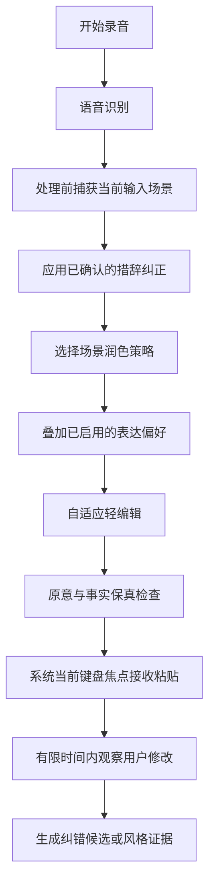

# Type4Me 智能感知模式产品设计文档

> 文档类型：产品设计
> 文档状态：当前有效（首版已实现，持续校准）
> 适用平台：Type4Me macOS
> 文档范围：智能感知模式、场景感知、个性化表达、措辞纠正感知
> 设计日期：2026-08-09
> 最后校验：2026-08-11
> 实现基线：`302e9b4`，体验修订至 `9d91b92`
> 阅读说明：文中的“当前缺口”保留设计时语境；功能状态以页首与代码为准

> 专项开发设计：`docs/features/intelli-sense/user-correction-text-recognition-design.md`，用于升级用户修改观察、历史数据闭环、中英文纠正识别和批量替换推断。

---

## 1. 执行摘要

Type4Me 新增一个官方自带模式：

- 中文显示名称：**智能感知**；
- 英文显示名称：**Intelli Sense**。

智能感知是“语音润色”的智能升级版。它仍然只完成一项核心任务：

> 将用户刚刚口述的内容整理成可以直接输入的文字。

与现有语音润色相比，智能感知增加三类感知能力：

1. **措辞纠正感知**：学习用户确认过的专有名词、错词映射和常用措辞；
2. **智能场景感知**：根据当前 App、输入区域和有限上下文调整语气、长度和格式；
3. **个性化表达感知**：逐步学习用户在不同软件和场景中的表达习惯。

本方案同时将现有“自动发现纠错（Beta）”迁入智能感知模式设置。纠错观察只由智能感知模式触发；用户通过现有卡片确认后，纠错词继续写入全局生词表，并在所有模式中生效。

---

## 2. 产品定位

### 2.1 一句话定义

智能感知是一种能够理解输入场景和用户表达习惯的个性化语音润色模式。

### 2.2 核心输入契约

无论用户口述的内容看起来像陈述、问题、命令还是请求，智能感知始终将其视为“用户希望输入的原始内容”。

例如：

| 用户口述 | 智能感知应做什么 | 智能感知不应做什么 |
|---|---|---|
| “你今天有空吗” | 输出一句自然的问题 | 回答用户是否有空 |
| “帮我把会议改到三点” | 整理成适合当前场景的文字 | 修改日历或执行操作 |
| “写一封邮件告诉他项目延期了” | 保留并整理这句口述本身 | 擅自生成一封完整邮件 |
| “翻译成英文” | 将这句话作为文字输出 | 翻译选中文本或上下文 |
| “打开微信” | 输出“打开微信” | 打开微信 |

### 2.3 与语音润色的关系

智能感知与语音润色共享相同的基本目标：提高语音转写文本的可读性，同时保留用户原意。

二者区别如下：

| 维度 | 语音润色 | 智能感知 |
|---|---|---|
| 处理目标 | 通用语音整理 | 有场景和个性化能力的语音整理 |
| 上下文 | 主要依据本次口述 | 感知 App、输入区域和有限上下文 |
| 输出风格 | 使用固定通用规则 | 根据场景选择语气、长度和格式 |
| 用户习惯 | 不主动学习 | 使用已形成的个人表达偏好 |
| 纠错学习 | 不启动新的隐式观察 | 可观察修改并生成待确认的纠错候选 |
| 可预测性 | 高 | 在保持原意的前提下自适应 |

现有语音润色模式保留，不被智能感知替代。希望获得固定、可预测结果的用户仍可继续使用语音润色。

### 2.4 与其他模式的边界

智能感知不吸收其他官方模式的能力：

- 不替代翻译模式；
- 不替代 Prompt 优化；
- 不替代命令模式；
- 不替代代办模式；
- 不替代随便问；
- 不替代 Mac 操作；
- 不替代任何用户自定义模式。

其他官方模式的中英文名称和产品行为在本轮均保持不变。

---

## 3. 背景与用户问题

### 3.1 现有语音润色的优势

Type4Me 已经能够：

- 去除无意义语气词和重复；
- 识别并保留用户中途改口后的最终表达；
- 修正明显的错别字和断句；
- 将两个以上具有独立信息的明确要点整理成清晰列表；
- 尽量保留用户原意、语气和表达风格。

### 3.2 仍然存在的问题

#### 同一套润色规则用于所有输入场景

聊天消息、邮件正文、工作文档、搜索框和代码注释对长度、语气和格式的要求不同。固定规则无法同时适合所有场景。

#### 输出仍然带有统一的“AI 整理感”

不同用户对句子长度、标题、列表、标点、礼貌程度和中英文表达有不同偏好。通用 Prompt 很难长期贴近具体用户。

#### 纠错记忆与润色体验没有形成闭环

现有自动发现纠错能够观察用户修改，但还没有与 App 场景、表达习惯和智能润色策略形成统一的内部学习机制。

### 3.3 产品机会

在不扩大任务范围的前提下，让语音润色理解“用户正在什么地方输入”以及“用户平时如何表达”，可以显著提高一次输出即可使用的比例。

---

## 4. 产品目标与非目标

### 4.1 产品目标

1. 保持语音润色简单、稳定的核心心智；
2. 根据当前输入场景自动选择合适的润色策略；
3. 在严格保留原意的前提下，使输出逐步接近用户本人；
4. 将用户纠错词自动感知整合进统一的个性化闭环；
5. 降低用户对输出进行二次修改的频率和幅度；
6. 个性化学习在后台自动完成，不要求用户理解或管理复杂的风格模型；
7. 只提供必要的能力开关、App 黑名单和表达习惯学习数据清除能力；
8. 不改变其他现有模式的行为。

### 4.2 明确非目标

智能感知不负责：

- 判断用户是想输入、提问、生成内容还是执行操作；
- 回答用户口述的问题；
- 根据一句简短要求生成用户没有口述出来的完整内容；
- 翻译、总结、改写或处理选中文本；
- 读取剪贴板并将其作为待处理对象；
- 执行 macOS 操作、调用工具或修改外部数据；
- 发送消息、提交表单、创建日程或完成其他外部动作；
- 读取整个屏幕、完整文档或其他 App 的私有数据；
- 从一次修改直接推断永久表达习惯；
- 用一个巨型 Prompt 取代现有所有模式。

---

## 5. 核心产品原则

### 5.1 只润色，不代办

系统只整理用户已经说出的内容，不替用户完成口述中提到的任务。

### 5.2 原意优先于场景适配

上下文只能影响表达方式，不能改变用户的事实、观点、意图或语言方向。

### 5.3 不无中生有

系统不得主动补充用户没有说出的事实、理由、结论、承诺、日期、称呼或行动项。

### 5.4 事实与风格分离

“Ghostty 的正确拼写”属于措辞纠正；“在 Slack 中偏好短句”属于表达偏好。两者使用不同的证据、存储和作用域。

### 5.5 一次修改不等于长期偏好

风格偏好必须由多次一致证据建立。用户单次删除某句话不代表以后都不需要同类内容。

### 5.6 最小必要上下文

只读取决定润色形式所需的最少信息。更深层上下文必须单独授权，并允许按 App 禁用，被禁用的 App 不会进行任何的智能感知。

### 5.7 其他模式保持确定性

新的场景策略和表达习惯学习仅属于智能感知，不在其他模式中采集或生效。纠错观察也只由智能感知触发，但确认后的词汇进入现有全局生词表，按照既有机制在所有模式中生效。

### 5.8 以减少交互为目标

智能感知的价值是让输出越来越准确、用户修改越来越少，而不是增加新的状态标签、策略选择和确认步骤。除词汇纠错继续使用现有确认卡片外，其他感知能力均在后台工作。

---

## 6. 三项感知能力

### 6.1 措辞纠正感知

#### 目标

识别用户对智能感知输出所做的词汇级修正，并在用户确认后避免重复犯错。

#### 适合学习的内容

- 专有名词和品牌名；
- 人名、项目名、产品名；
- 中英文混合词的正确大小写；
- 稳定的同音或近音错词映射；
- 用户长期固定使用的缩写。

#### 不适合学习的内容

- 一次性的日期、金额和数字；
- 整句事实变更；
- 用户临时改变观点；
- 密码、验证码、密钥等敏感信息；
- 无法判断是 ASR 错误还是内容改写的差异。

#### 学习流程

1. 智能感知成功注入文字；
2. 在有限时间内本地观察用户修改；
3. 识别可能的词汇级纠正；
4. 生成纠错候选；
5. 请求用户确认；
6. 正确词写入全局热词，错误词到正确词的映射写入全局片段替换；
7. 后续在所有模式的转写或润色前生效。

系统不得未经确认自动保存新纠错。

### 6.2 智能场景感知

#### 目标

识别用户正在进行哪一类文字输入，从而调整润色的语气、长度和格式，而不是判断或执行用户口述中的任务。

#### 场景信号

按信息深度分层：

| 层级 | 信息 | 用途 | 默认策略 |
|---|---|---|---|
| L1 | App 名称、Bundle ID、App 类别 | 判断聊天、邮件、文档、开发工具等大类 | 非黑名单 App 内可用 |
| L2 | 输入控件角色、是否为单行或多行输入 | 判断搜索框、标题、正文等形式 | 非黑名单 App 内可用 |
| L3 | 光标附近有限文字 | 为上下文感知提供语气、称呼和术语参考 | 非黑名单 App 内可用 |
| L4 | 完整窗口或文档内容 | 深层上下文理解 | 不在规划范围内 |

Beta 阶段即使用户开启上下文感知，`terminal` 和 `development` 类别也不读取 L3 正文，只使用 App 类别和输入控件信息。终端命令、代码文件和开发工具中可能包含密钥、Token、环境变量或证书内容，不能仅依赖敏感词正则决定是否读取。后续如要开放，需经过单独的隐私评审和灰度验证。

#### 场景只允许影响

- 句子长短；
- 段落和列表形式；
- 礼貌程度；
- 口语化或书面化程度；
- 标点和换行风格；
- 对附近文本已有称呼、术语和语气的有限匹配。

#### 场景不得影响

- 用户表达的事实和观点；
- 是否回答一个问题；
- 是否执行一个动作；
- 是否生成用户没有说出的内容；
- 是否处理选中文本或剪贴板；
- 输出语言，除非用户口述本身已经使用该语言。

#### 初始场景策略

场景策略建立在统一的“基础润色策略”之上。基础润色采用“自适应轻编辑”：无需修改时保持忠实，存在口语噪声、重复、废弃半句或明确改口时主动整理。它完整继承语音润色能力，并明确包含：

- 删除“嗯、啊、那个”等无意义语气词和停顿词；
- 删除无意义重复，合并因犹豫产生的废弃半句；
- 识别明显改口，只保留用户最终确认的表达；
- 修正高置信度的错别字、断句和标点问题；
- 在不改变内容顺序和表达强度的前提下，使句子通顺、可读；
- 保留用户原有词汇、语气、中英文混合方式和关键信息；
- 遇到无法确定的修改时保留原文，不主动优化。

基础润色策略默认不添加标题、称呼、落款或用户未说出的内容，但会主动识别列表意图：当口述明确包含两个及以上具有独立信息的实质要点时，优先整理为列表。口述带有顺序或步骤时使用编号列表，否则使用项目符号。恰好两个非常简短、对称且合成一句仍然清楚的选项或并列项不强制拆分；单一事项不列点。列表化可以保留有意义的引导句，但不得凭空添加标题。

明确的多要点意图高于普通场景的紧凑度和表达习惯偏好。因此聊天、邮件、文档、浏览器普通正文和开发工具中的多要点口述均可列表化。搜索框、标题栏和终端命令继续保持单行结构。

| 场景 | 默认润色策略 |
|---|---|
| 即时聊天 | 简短自然、不加正式标题；明确多要点时使用紧凑列表 |
| 邮件正文 | 句子完整、礼貌清晰，但不擅自补主题、称呼和落款 |
| 文档与笔记 | 允许自然分段；明确多要点时优先列表化 |
| 搜索框 | 尽量保留为简短关键词，不扩写成完整回答 |
| 代码编辑器 | 保留技术术语、标识符和代码样式，避免文学化改写 |
| 终端 | 最大程度忠实保留命令和参数，只修正明确的识别错误 |
| 未知 App | 回退到上述基础润色策略 |

### 6.3 个性化表达感知

#### 目标

通过长期、重复的行为证据，让智能感知在后台逐步接近用户在不同场景中的真实表达习惯。

#### 可学习信号

- 经常缩短或保留较长句子；
- 经常删除标题、编号或列表；
- 偏好自然段还是项目符号；
- 聊天中偏好更直接或更礼貌；
- 中英文标点和空格习惯；
- 是否保留较强的主观语气；
- 特定 App 中稳定出现的格式偏好。

#### 不可学习信号

- 具体事实、日期、金额和人名变更；
- 单次删改；
- 敏感信息；
- 无法稳定归类的内容差异；
- 可能由输入法组合、撤销或误触产生的修改。

#### 学习机制

```text
观察到修改
    ↓
提取抽象风格信号
    ↓
在同类场景重复出现
    ↓
提高置信度并形成候选偏好
    ↓
达到阈值后启用
    ↓
持续接受相反证据，自动增强、衰减或停用
```

该评估过程属于内部模型，不直接向用户展示偏好清单、置信度、推断原因或状态变化，也不为表达习惯提供确认卡片。用户只通过最终输出是否更贴近自己来感知效果。

#### 偏好作用域

优先级由具体到通用：

1. 具体 App 偏好；
2. App 类别偏好，例如聊天、邮件、文档；
3. 全局表达偏好；
4. Type4Me 默认润色策略。

具体作用域的数据不足时自动回退上一级，避免某个 App 中的偶发修改污染所有场景。

---

## 7. 智能感知处理流程



### 7.1 处理顺序

1. 完成语音识别；
2. 处理前捕获当前 App 和输入控件，允许录音期间切换应用；
3. 应用用户已经确认的词汇纠正；
4. 根据 App 和控件选择场景润色策略；
5. 叠加当前作用域内已启用的表达偏好；
6. 对口述内容进行自适应轻编辑；
7. 检查是否新增事实、删除关键信息或改变原意；
8. 使用系统当前键盘焦点粘贴最终文字，不因 App/输入框/光标变化重新润色或拦截粘贴；
9. 在满足安全条件时观察后续修改。

场景快照在发起润色前确定。若请求发出后用户再次切换应用，内容仍按本次快照处理，落点由完成时的键盘焦点决定；历史如实显示处理依据。识别结束前切换应用会采用新环境。

### 7.2 允许的文本变化

- 删除“嗯、啊、那个”等无意义口语噪声；
- 合并无意义重复；
- 根据用户改口只保留最终表达；
- 修正明显的错别字和断句；
- 调整标点、换行和段落；
- 将两个以上具有独立信息的明确要点整理成列表；
- 根据场景适度调整口语化、书面化和礼貌程度；
- 根据稳定学习到的表达习惯调整表达形式。

### 7.3 禁止的文本变化

- 回答口述中的问题；
- 执行口述中的命令；
- 将简短要求扩写成完整成品；
- 新增用户没有说出的理由、结论、事实或承诺；
- 改变立场、语义强度或否定关系；
- 擅自翻译到另一种语言；
- 根据选中文本或剪贴板生成结果；
- 因场景推断而删除用户明确说出的关键信息。

### 7.4 失败回退

- 无法识别 App：使用第 6.2 节定义的基础润色策略；
- 无法读取控件：只使用 App 级策略；
- 个性化数据不足：使用场景默认策略；
- 场景策略冲突：优先保留原意并减少处理；
- LLM 不可用或超时：回退原始转写或现有安全降级路径；
- 只有硬事实或安全边界检查失败时，才使用全局片段替换后的 ASR 文本，不额外生成低强度候选。

体验阶段以“优先展示真实润色价值”为 Guard 原则。整段回退的代价很高，会同时丢失去噪、去重复、列表整理和场景适配，因此只有确定会造成事实或安全事故的错误才允许触发：最终数字、日期、金额、URL、邮箱、字面路径被改变，强禁止或“绝不”关系被删除，整段语言被替换，候选回答/执行了任务，极端扩写、工具结构或敏感信息泄露。

普通英文口头语（例如 `OK`）、技术缩写、标识符、术语规范化、弱否定的等价改写、措辞变化和列表结构变化不得触发整段回退；这些变化最多记录 warning，交由实际体验和语义评测判断。Prompt 仍应尽量保留有意义的技术词，但 Guard 不以简单的 token 字面相等代替语义判断。

---

## 8. 用户体验设计

### 8.1 模式入口

在“模式”中新增官方自带模式：

- 中文显示名称：智能感知；
- 英文显示名称：Intelli Sense；
- 建议描述：结合当前输入场景和你的表达习惯，智能整理口述内容；
- 可绑定独立快捷键；
- 支持按住说话和切换式录音；
- Beta 阶段不替换用户现有默认模式；
- 新版本开始记住用户最后一次主动选择的有效模式；首次升级尚无该记录时保持升级前的启动行为，不因补入 Intelli Sense 自动切换。

### 8.2 智能感知模式设置

不新增一级“个性化”设置页。所有必要配置均放在“智能感知”模式自己的设置页面中：

- 应用感知：是否读取当前 App 和输入控件，用于选择润色策略；
- 上下文感知：是否读取光标附近的有限文字，用于匹配当前语气、称呼和术语；
- 表达习惯感知：是否在后台学习用户稳定的表达习惯；
- 纠错词检测：是否观察智能感知输出后的词汇修改并生成纠错候选；
- App 黑名单：列入后，该 App 中不进行应用、上下文、纠错词或表达习惯感知；
- 清除表达习惯数据：清除智能感知形成的内部表达习惯模型，不删除全局生词表。

设置页不展示推断出的风格标签、偏好列表、置信度或学习过程。

### 8.3 交互约束

- 处理完成后不显示实时场景或策略标签；
- 不提供“更忠实”“更自然”等本次结果快速切换；
- 不为表达习惯生成确认卡片或学习通知；
- 不要求用户持续参与模型训练；
- 唯一保留的确认交互是纠错词候选，并完全复用当前卡片及其交互，不在本项目中改版。

### 8.4 历史记录中的智能感知说明

历史记录属于用户主动回看的低干扰场景。使用 Intelli Sense 产生的记录在展开后显示“智能感知说明 / Intelli Sense Details”，用于说明本次处理参考了哪些确定性信号，以及最终采用了哪类处理策略。

说明固定分为三行：

- 感知环境：App 与输入控件，例如“Dia · 搜索框”；
- 处理依据：本次实际参与处理的应用、上下文和稳定表达习惯层，或黑名单、敏感、无可用上下文等降级状态；
- 处理结果：最多三项重要变化，例如“转为搜索关键词”“采用最终改口内容”“规范标点和格式”。

交互边界：

- 折叠状态保持当前历史列表设计，不增加徽章、标签或提醒；
- 仅 Intelli Sense 且具有新轨迹数据的记录显示，旧记录和其他模式不显示；
- 说明不可编辑，不提供快速纠偏或“以后不要这样改”等操作；
- 表达习惯只允许显示“稳定表达习惯参与处理”，不得展示具体画像、规则、置信度或学习过程；
- 说明由确定性请求状态、输入输出差异和 Guard 结果生成，不额外请求 LLM 生成解释；
- 首版不加入历史筛选、统计或 CSV 导出。

展开区底部同时提供本次处理链路的模型来源：麦克风图标后显示 ASR 服务及模型，CPU 图标后显示实际发起处理请求的 LLM 服务及模型。两者必须来自该条记录产生时冻结的快照，不能读取当前设置来解释旧记录。未调用 LLM 的记录不显示 CPU 项；升级前的旧记录因缺少可靠数据保持不显示，不进行推测回填。

模型来源后以一位小数显示该阶段耗时。ASR 耗时定义为用户结束录音到最终转写可用的尾延迟，不包含用户说话时间；LLM 耗时定义为最终采用或尝试采用的模型请求从发起到返回/失败的时长。旧记录不回填耗时。

---

## 9. 用户纠错词自动感知迁移

### 9.1 迁移目标

将现有“自动发现纠错（Beta）”迁移到：

> 智能感知模式设置 → 纠错词检测

### 9.2 新文案

> 仅在智能感知模式下，本地观察最近一次输出及随后发生的修改。发现可能的词汇纠正时会先请求确认，不会自动保存。中文使用精简 Jieba 与系统分词交叉判断；边界冲突或输入法组合文本不稳定时不会自动生成映射。

### 9.3 生效范围

| 数据类型 | 智能感知 | 其他模式 |
|---|---|---|
| 用户手动维护的既有热词与片段替换 | 生效 | 生效 |
| 纠错感知产生并经确认的词汇 | 生效 | 生效 |
| 表达习惯模型 | 生效 | 不生效 |

纠错观察只在智能感知模式中运行。用户确认候选后，继续复用现有保存逻辑：正确词加入全局热词，错误词到正确词的映射加入全局片段替换。两者共同构成现有全局生词表能力，并在所有模式中生效，不新增独立纠错存储或“提升为全局”步骤。

### 9.4 候选确认

纠错候选继续复用当前已经实现的确认卡片、字段和操作，本项目不修改卡片结构、文案或交互。除纠错词外，场景感知和表达习惯感知均不显示确认卡片。

### 9.5 升级迁移原则

1. 用户手动维护的现有热词和片段替换不移动、不删除；
2. 旧开关状态保留；
3. 新版本中该开关只控制智能感知是否启动纠错观察；
4. 其他模式不启动纠错观察；
5. 用户确认后的词汇写入现有全局热词和片段替换，并在所有模式中生效；
6. 设置入口迁移到智能感知模式设置页，不新增一级设置页面。

---

## 10. 内部学习数据设计

### 10.1 数据分类

| 类型 | 示例 | 存储内容 |
|---|---|---|
| 表达习惯模型 | Slack 中逐渐偏向短句 | 内部特征、权重、证据计数和更新时间 |
| App 配置 | Mail 开启应用感知 | Bundle ID、感知开关和黑名单状态 |

纠错词不进入新的内部学习数据库，而是直接沿用现有 `HotwordStorage` 与 `SnippetStorage`。固定的场景默认策略属于产品配置，不从用户行为学习，也不作为用户数据存储。

### 10.2 表达习惯内部状态

- `insufficient`：证据不足，不影响输出；
- `learning`：正在积累重复证据，尚未达到生效阈值；
- `stable`：达到稳定阈值，可参与智能感知输出；
- `decaying`：持续出现相反证据，逐步降低影响；
- `inactive`：失效或被总开关关闭，不参与输出。

这些状态只供内部计算和质量评估使用，不直接呈现在产品界面中，也不要求用户逐项确认。

### 10.3 数据最小化

- 只保存用于计算的抽象特征，不保存完整输入和输出全文；
- 纠错词继续由现有全局生词表存储，不复制到表达习惯模型；
- 场景信息保存 App 标识与类别，不保存窗口完整内容；
- 临时上下文在本次处理结束后释放；
- 调试日志不得记录敏感上下文或长期画像全文。

### 10.4 用户控制

用户不直接管理复杂的表达习惯模型，只在智能感知模式设置页获得必要的粗粒度控制：

- 分别开启或关闭应用感知、上下文感知、纠错词检测和表达习惯感知；
- 通过 App 黑名单禁止指定 App 参与任何感知；
- 清除智能感知形成的表达习惯数据。

不提供表达偏好的逐项查看、解释、编辑、暂停、撤销或导出能力。“清除表达习惯数据”不删除已经确认并进入全局生词表的纠错词；纠错词继续通过现有词汇管理能力维护。本项目只复用现有纠错确认卡片，不扩展新的纠错管理界面。

---

## 11. 隐私与安全

### 11.1 默认权限

MVP 默认只使用：

- 当前 App 名称和 Bundle ID；
- 输入控件的基础角色；
- 本次用户口述；
- 已确认的纠错词和本地表达习惯模型。

### 11.2 上下文感知

上下文感知读取光标附近的有限文字，必须：

- 单独说明用途；
- 提供开关；
- 提供 App 黑名单；
- 限制读取长度；
- 不进入长期存储；
- 在密码和敏感控件中自动禁用；
- Beta 阶段不读取终端和开发工具中的上下文正文；
- 对允许读取的其他场景执行二次敏感扫描，命中 API Key、Secret、Bearer/JWT、私钥或证书头、长 Base64/Hex 串等模式时立即丢弃正文。

### 11.3 敏感场景

以下情况不启动修改观察或个性化学习：

- 密码框和安全输入区域；
- 检测到验证码、密钥或高风险敏感模式；
- 注入失败、取消或撤销路径；
- 无法可靠区分 Type4Me 输出和其他输入来源；
- 当前 App 位于智能感知黑名单中。

---

## 12. 性能设计

智能感知是高频输入功能，场景与个性化不能显著破坏语音输入的即时感。

### 12.1 延迟原则

- L1/L2 场景快照在最终 LLM 前快速完成，最多等待 300ms；
- 个性化配置从本地缓存读取；
- 场景选择使用确定性策略优先，不额外增加一次 LLM 路由请求；
- 场景、表达偏好和纠错以结构化参数合并进同一次润色请求；
- 任一增强步骤超时都应降级，而不是阻塞输出。

### 12.2 关键指标

- 停止录音到文字注入的 P50/P95；
- 相比语音润色增加的额外耗时；
- 场景读取耗时和失败率；
- 个性化配置读取耗时；
- 降级到基础润色策略或原始转写的比例；
- Guard 拒绝率、拒绝原因分布和回退 ASR 文本占比；
- Guard 回退后用户继续修改的比例，用于识别规则过严造成的误拒绝。

---

## 13. 成功指标

### 13.1 核心指标

**智能感知输出无需修改率**：输出后用户没有进行实质性修改即可继续工作的会话比例。

### 13.2 辅助指标

- 相比语音润色，用户修改字符数和编辑距离的变化；
- 智能感知模式使用频率和留存；
- 纠错候选接受率和拒绝率；
- 已确认纠错再次命中后的正确率；
- 开启表达习惯感知前后的平均编辑距离变化；
- 各感知项关闭率；
- App 黑名单使用率；
- 事实保真失败率；
- Guard 拒绝率与回退 ASR 占比；
- Guard 回退后的平均编辑距离；
- `mustChange` 案例的无效原样输出比例；
- 预期安全候选被 Guard 错误回退的比例；
- P50/P95 处理延迟。

### 13.3 质量红线

- 回答用户口述问题的已知事件应为 0；
- 执行或触发外部操作的事件必须为 0；
- 主动生成用户未口述事实的比例应接近 0；
- 改变否定关系、数字或关键事实的比例应接近 0；
- 敏感信息进入长期个性化存储的已知事件必须为 0；
- 其他模式因智能感知个性化发生行为改变的回归必须为 0。

---

## 14. 分阶段范围

### Phase 0：产品与基础准备

- 确认智能感知的名称、定位和边界；
- 定义独立模式标识与设置入口；
- 设计个性化数据模型和迁移方案；
- 将自动发现纠错入口规划到智能感知模式设置页；
- 建立“不回答、不生成、不执行”的回归测试规范。

### Phase 1：场景感知润色 MVP

- 新增智能感知模式；
- 复用现有语音润色能力；
- 使用 App、App 类别和输入控件选择润色策略；
- 支持聊天、邮件、文档、搜索框、代码编辑器和终端策略；
- 使用本文明确定义的基础润色策略，并提供原始转写回退；
- 迁移用户纠错词自动感知。

### Phase 2：个性化表达 MVP

- 收集抽象风格信号；
- 建立全局、App 类别和具体 App 三层偏好；
- 使用候选、重复强化和置信度机制；
- 在后台自动更新模型，不新增确认卡片或偏好管理界面；
- 增加事实与语义保真校验。

### Phase 3：上下文感知

- 经用户授权读取光标附近限定长度的文字；
- 匹配附近文本的称呼、术语和语气；
- 完善上下文感知、App 黑名单和敏感控件保护；
- 根据真实数据优化场景策略与个性化强度。

完整窗口、文档级理解、内容生成和动作执行不进入上述路线图。

---

## 15. MVP 验收标准

### 15.1 功能验收

- 智能感知拥有独立模式入口和快捷键；
- 对同一段口述可根据聊天、邮件、文档等场景调整表达形式；
- 不回答口述中的问题；
- 不执行口述中的命令；
- 不处理选中文本或剪贴板；
- 不擅自将简短要求扩写成完整内容；
- 用户关闭表达习惯感知时，仍可作为场景感知版语音润色正常工作；
- 纠错观察只在智能感知成功注入后启动；
- 所有新纠错仍需用户确认；
- 纠错确认完全复用当前卡片；
- 场景和表达习惯感知不产生卡片、标签或额外交互；
- 其他模式行为不变；
- 无场景信息或增强处理失败时能够正常降级。

### 15.2 学习机制验收

- 单次风格修改不会立即成为活跃偏好；
- 重复证据达到阈值后在后台生效；
- 具体 App 偏好不会污染其他 App；
- 相反证据能够降低旧偏好置信度；
- 关闭表达习惯感知后内部模型不再参与输出或继续学习；
- 清空后缓存中不再残留对应偏好；
- 表达习惯学习过程不产生确认卡片或用户可见的偏好清单；
- 敏感信息和具体事实不会进入风格档案。

### 15.3 回归验收

- 快速模式行为不变；
- 语音润色行为不变；
- 翻译和 Prompt 优化行为不变；
- 命令、代办、随便问和 Mac 操作行为不变；
- 用户自定义模式不变；
- 现有模式排序、快捷键和自定义 Prompt 不被覆盖；
- App 切换、注入失败和取消录音不会留下观察任务。

---

## 16. 测试矩阵

### 16.1 边界测试

| 输入环境 | 用户口述 | 预期输出行为 |
|---|---|---|
| Slack 输入框 | “你今天有空吗” | 输出自然的问题句，不作回答 |
| Mail 正文 | “帮我写封邮件告诉客户延期到周一” | 整理这句原话，不生成完整邮件 |
| 任意文本框 | “打开微信” | 输出这句话，不执行操作 |
| 选中一段中文 | “翻译成英文” | 输出这句话，不处理选中文本 |
| 搜索框 | “Swift actor 数据竞争” | 保留为简洁搜索关键词 |
| 终端 | “git status” | 忠实输出命令，不解释也不执行 |

### 16.2 场景测试

- 同一段完整口述在 Slack、Mail 和 Notion 中只产生合理的语气与格式差异；
- 场景变化不得造成事实、否定关系和数字变化；
- App 未识别时回退本文定义的基础润色策略；
- 控件读取失败时不阻塞；
- 录音开始后切换 App，以处理前的目标环境润色；
- 请求发出后换 App、切换输入框或移动光标，不新增 LLM 重试或拦截原生粘贴；
- 上下文捕获期间换 App，旧正文不进入请求，按新 App 信息和黑名单降级；
- AX 不可读的编辑器仍可粘贴；自动化和手动文字输入窗口保持原来的上下文来源；
- 用户关闭某 App 场景感知后不应用其专属策略。

### 16.3 纠错迁移测试

- 旧开关不存在、开启和关闭三种升级路径；
- 用户手动维护的既有热词和片段替换保持现状；
- 其他模式不启动新的观察；
- 智能感知注入成功后启动观察；
- 注入失败、取消和敏感控件不启动观察；
- 纠错保存失败不产生半写入；
- 经纠错感知确认的词汇写入全局生词表，并在所有模式生效；
- 删除后缓存立即失效。

### 16.4 独立语义评测

真实模型质量不并入普通构建和单元测试。使用独立 `Evaluation/IntelliSenseEval` 包手动运行 126 条分层文本案例，其中 28 条为 smoke 子集；本轮不测试音频或 ASR 服务。

评测显式注入 App、控件、有限上下文、感知开关与合成稳定表达档案，覆盖中文、英文和中英文混合口述。报告同时保留生产 Prompt 哈希、模型候选、Guard warning/reject、最终输出、输入输出 diff、延迟、自动硬约束和人工评语栏；不自动调用裁判模型。

首版验收：回答、执行、事实新增和敏感泄露为零；核心去噪和改口 `pass/acceptable` 不低于 95%；App 与上下文不低于 85%；需要改写却原样输出及无需改写却过度改写均不高于 5%；Intelli Sense 在基础润色案例上不得弱于 Voice Polish。

---

## 17. 发布与灰度建议

1. 智能感知初期标记 Beta，不设为默认模式；
2. 第一轮只开放 L1/L2 场景；上下文感知按后续阶段开放；
3. 应用感知、上下文感知、纠错词检测和表达习惯感知默认关闭，不增加首次使用确认流程；
4. 纠错学习继续保持人工确认；
5. 先观察无需修改率、编辑距离、事实保真和延迟；
6. 用户仍可通过原有模式选择方式使用语音润色和快速模式，不新增快速纠偏入口；
7. 达到质量门槛后再考虑向新用户推荐，但不自动替换老用户配置。

---

## 18. 已确认产品决策

1. 中文显示名称为“智能感知”，英文显示名称为“Intelli Sense”；
2. 智能感知是语音润色的升级版，不是万能模式；
3. 它只整理用户已经口述的内容；
4. 它不回答、不生成额外内容、不处理其他内容、不执行动作；
5. 它的新增能力只有措辞纠正感知、智能场景感知和个性化表达感知；
6. 场景信息只影响语气、长度和格式，不改变任务类型和原意；
7. 用户纠错词自动感知迁移到智能感知模式设置页；
8. 场景与表达习惯学习只在智能感知中观察和生效；
9. 纠错观察只由智能感知触发，确认后的词汇进入全局生词表并在所有模式中生效；
10. 纠错词继续复用现有确认卡片，其他感知能力不提供确认卡片；
11. 表达习惯模型不向用户逐项展示、解释、编辑或撤销；
12. 不在处理完成时显示实时策略标签，也不新增快速纠偏交互；历史记录展开详情可显示脱敏、不可操作的智能感知说明；
13. 不新增一级个性化设置，必要开关和 App 黑名单位于智能感知模式设置页；
14. 纠错感知完全复用现有全局热词与片段替换存储，不新建专属纠错库；
15. 语音润色及其他官方模式继续保留，名称和行为暂不调整；
16. 已进入首版实现与效果校准阶段；生产逻辑与评测共用唯一 Core，评测仍保持手动且与产品构建隔离。
17. 默认编辑强度为自适应轻编辑；Guard 只拦截明确硬错误，一般措辞、格式和结构变化只记录 warning。
18. 普通“不是 A，是 B”默认是完整对比或澄清，不自动视为说话人口误；删除 A 必须有“不对、哦不、改成”等明确修正证据或句子废弃重启证据。
19. 输出语言跟随说话人的句架语言；英文路径、技术词和标识符占比很高，也不得触发整句翻译。

---

## 19. 已确认设置策略

1. 应用感知默认关闭；
2. 纠错词检测默认关闭，升级时保留旧开关状态；
3. 表达习惯感知默认关闭；
4. 用户不能手动指定 App 场景类别，只能配置 App 黑名单；
5. 上下文感知进入后续版本，默认关闭；
6. “清除表达习惯数据”不清除已经确认并写入全局生词表的纠错词；
7. 语音润色使用固定通用规则；智能感知在相同基础润色能力之上，按用户开启的设置增加应用、上下文和表达习惯感知；
8. 所有设置均位于智能感知模式设置页，不新增一级设置页面。

---

## 20. 后续设计产物

完整开发设计见 `docs/features/intelli-sense/development-design.md`。后续迭代按该文档拆分或细化实施产物：

1. 场景分类与润色策略规范；
2. 智能感知专用润色 Prompt 设计；
3. 原意与事实保真校验规则；
4. 内部表达习惯模型 schema 和置信度机制；
5. 纠错观察迁移方案；
6. App、输入控件与有限文字的上下文感知采集规范；
7. 智能感知模式设置页设计，并确认完全复用现有纠错卡片；
8. 性能预算与降级策略；
9. 端到端边界测试集；
10. Beta 灰度、埋点与回滚方案。
